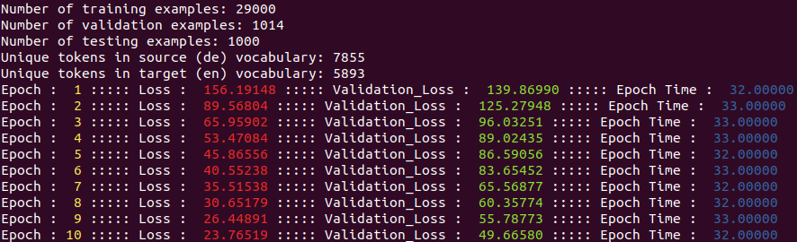

# Sequence to Sequence Learning with Neural Networks
Implementing basic sequence to sequence machine translation. In this implementation, we are passing the embedded target token and previous hidden state to the decoder.
## Model Architecture
<br>
## Running this Project
To run this project execute the following command<br>
```python3 Main.py```<br>
## Results
The following results have been obtained by using just 10 epochs. More accurate results can be obtained by training it more.<br>
<br>
