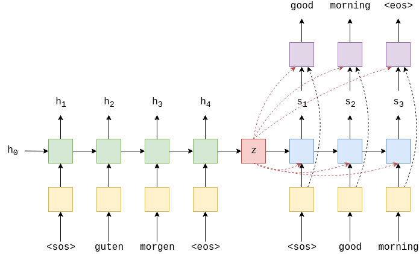
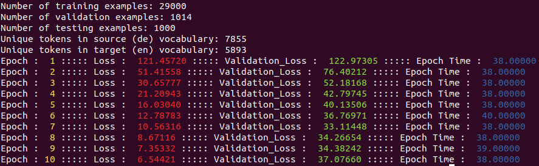

# Learning Phrase Representations using RNN Encoder-Decoder for Statistical Machine Translation
Implementing an advanced version of basic sequence to sequence machine translation, to achieve a higher accuracy. Instead of the decoder taking just the embedded target token and the previous hidden state as inputs, it also takes the context vector z(output of encoder).
## Model Architecture
<br>
## Running this Project
To run this project execute the following command<br>
```python3 Main.py```<br>
## Results
The following results have been obtained by using just 10 epochs. More accurate results can be obtained by training it more.<br>
<br>
